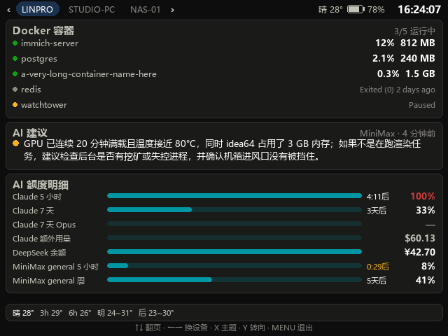
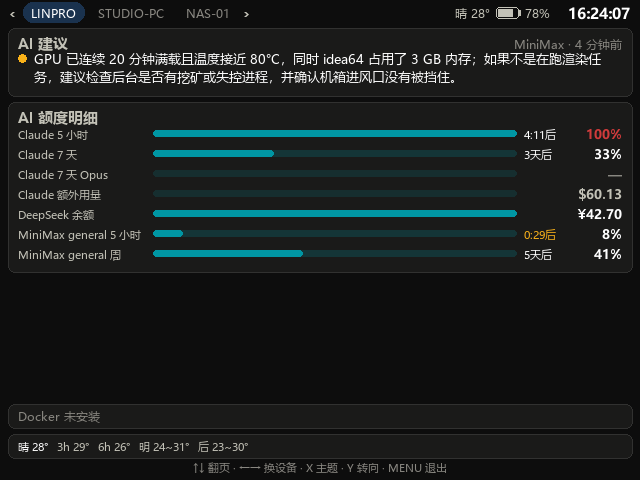
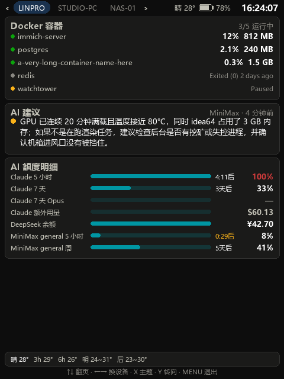
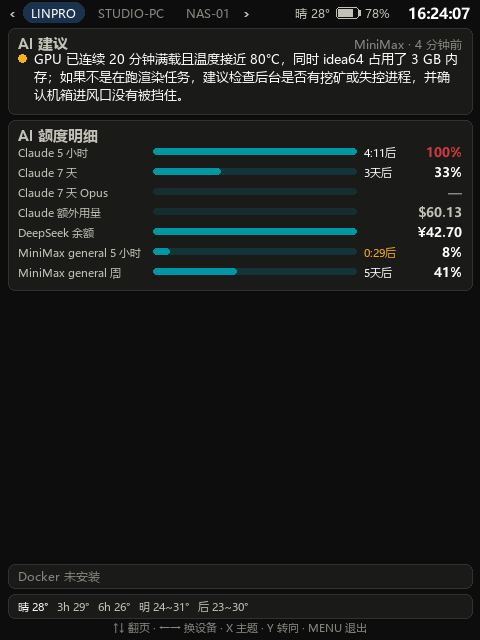
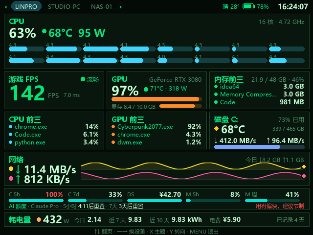
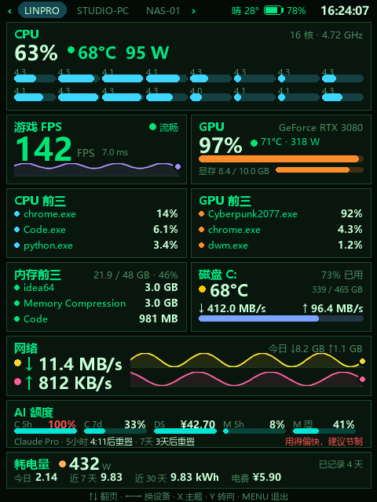

# PC Monitor — 掌机 WiFi 实时看电脑状态

在 Windows PC（或 Linux 服务器）上跑一个小服务，把 CPU / 内存 / 网络 / GPU /
游戏 FPS 画成一张仪表盘，通过 WiFi 以 MJPEG 流推给掌机全屏显示。掌机会自己扫局域网找出所有能监控
的 PC，左右键切换，Y 键转屏（支持竖屏），自己的电量也会显示在顶栏、低电量时震动。

支持三类掌机，共用同一个 PC 端服务：

| 掌机 | 系统 | 播放器 | 部署位置 |
|---|---|---|---|
| Miyoo Mini Plus | Onion OS | ffplay | `/mnt/SDCARD/App/PCMonitor` |
| Powkiddy X55 等 RK3566 机器 | ROCKNIX | mpv | `/storage/roms/ports` |
| Anbernic RG35XX Pro 等 | muOS | ffmpeg → `/dev/fb0` | `/mnt/mmc/MUOS/application/PC Monitor` |

第一页包含：CPU 总占用 / 温度 / 功耗 / 每个逻辑核心的占用与实时频率、游戏 FPS、
GPU 占用 / 温度 / 功耗 / 显存、CPU / GPU / 内存 各自占用前三的进程、系统盘温度与
读写速度、网络实时上下行与当日累计流量、AI 额度（Claude / DeepSeek / MiniMax）、
整机功率与今日 / 近 7 天 / 近 30 天累计电量，顶栏还有掌机电量、当前天气和时间。

**为什么这么设计**：掌机是 ARMv7 双核、没有 python/lua/编译器，但自带 `ffplay`。
所以让 PC 承担全部采集与绘图，掌机只解码一路 640×480 MJPEG——完全在 Cortex-A7
的能力范围内，也不需要交叉编译任何东西。

## 效果图

`preview.py` 用假数据渲染的仪表盘，横 / 竖两套版式各一张（进游戏 / 平时）：

| 横版 · 进游戏 | 横版 · 平时 |
|---|---|
|  |  |

| 竖版 · 进游戏 | 竖版 · 平时 |
|---|---|
|  |  |

第二页（掌机上按 **上 / 下** 翻过去）：Docker 容器、AI 建议、AI 额度明细
（第一页放不下的 Opus / 额外用量 / MiniMax 各模型组）和天气预报。这一页没有固定
网格：容器有几个就占几行，建议是一句还是一段也不一定，都按内容定高，剩下的留白：

| 横版 · 有 Docker | 横版 · 没有 Docker |
|---|---|
|  |  |

| 竖版 · 有 Docker | 竖版 · 没有 Docker |
|---|---|
|  |  |

换个主题（掌机上按 **X**，网页版上按 **T**，或在设置页里改默认值）——「终端绿」是
黑底绿字的终端风格，各项指标改用鲜艳的 ANSI 色区分，圆角也收成直角：

| 终端绿 · 横版 | 终端绿 · 竖版 |
|---|---|
|  |  |

> 这些图由 `python preview.py` 重新生成，方便改版式后第一时间肉眼检查。

## 组成

| 文件 | 作用 |
|---|---|
| `server.py` | MJPEG 服务，帧生产线程 + HTTP 接口 |
| `metrics.py` | 采集 CPU / 内存 / 网络 / GPU / 进程 / 当日流量 |
| `sysinfo.py` | 这些数从哪来：Windows 上是 psutil，Linux 上直接读 `/proc`（于是 Linux 端零第三方依赖） |
| `power.py` | 整机功耗估算与按天累计（今日 / 近 7 天 / 近 30 天） |
| `dockerstat.py` | 后台调 `docker ps` / `docker stats`，没装 Docker 也不报错 |
| `diskstat.py` | 系统盘温度（Windows 免管理员的 IOCTL / Linux 的 hwmon）与读写速度、容量 |
| `advice.py` | 运行状况快照留存，定期让 AI 判断有没有异常 |
| `perfcounters.py` | 通过 PDH 性能计数器读 CPU / GPU 各进程占用（带本地化处理，仅 Windows） |
| `sensors.py` | CPU 温度 / 功耗 / 每核频率：Windows 读 MSI Afterburner 共享内存，Linux 读 hwmon + cpufreq + RAPL |
| `rtss.py` | 从 RivaTuner 共享内存读游戏 FPS（仅 Windows） |
| `weather.py` | 天气：公网 IP 定位 / 城市名解析 / 经纬度，Open-Meteo 免费接口 |
| `aiquota.py` | 轮询 Claude / DeepSeek / MiniMax 的额度与余额 |
| `alerts.py` | 5 小时额度过线时记一条告警（写日志与 `/alert.json`） |
| `theme.py` | 配色主题（深色 / 终端绿），串流和网页版共用一套 |
| `webui.py` | 高清网页版仪表盘，浏览器里矢量重绘，键盘 / 按钮 / 触摸操作 |
| `webjson.py` | 共享的 HTTP GET + JSON 小助手 |
| `render.py` | Pillow 绘制仪表盘（横/竖两套版式 + 旋转 + 180° 预旋转） |
| `preview.py` | 用假数据出图，改版式时看效果 |
| `make_icon.py` | 生成掌机启动器图标 |
| `deploy_device.py` | 把掌机端推送过去（`--miyoo` / `--rocknix` / `--muos`） |
| `paths.py` | 区分代码目录和可写的状态目录（exe 旁边 / `PCMON_DATA` / `~/.local/share`） |
| `build_exe.py` | 打包成单文件 `dist/PCMonitor.exe` |
| `build_deb.py` | 打包成 `dist/pcmon_1.0.4_all.deb`，装完即是一个 systemd 服务 |
| `device/` | 掌机端，一个固件一套：Onion 用 `launch.sh` / `config.json` / `settings.cfg`；ROCKNIX 用 `launch_rocknix.sh` / `settings_rocknix.cfg`；muOS 用 `mux_launch.sh` / `launch_muos.sh` / `settings_muos.cfg` |

## 用 exe 跑（推荐，换机器不用装环境）

```
python -m pip install pyinstaller
python build_exe.py
```

产出 `dist/PCMonitor.exe`（单文件，约 17 MB）。**复制到任何 Windows 机器上双击即可**，
不需要装 Python / psutil / Pillow。

- `config.json`、`traffic.json` 会生成在 **exe 所在目录**（不是临时目录——打包后
  `__file__` 指向一个退出即删的解包目录，所以这两个路径走 `paths.base_dir()`）。
  换句话说，exe 放哪儿，配置和当日流量就存哪儿。
- 开机自启：`PCMonitor.exe --install-autostart`，取消用 `--remove-autostart`。
  它在「启动」文件夹里写一个 `PC Monitor.vbs`，不需要管理员权限。用 VBScript 通过
  `WScript.Shell.Run` 以隐藏窗口方式拉起 exe，开机不会闪出控制台窗口，静默在后台跑。
- 换端口：`PCMonitor.exe --port 8888`（或改 `config.json` 里的 `port`）。
- 首次运行 Windows SmartScreen 可能提示未知发布者——exe 没有代码签名，选「仍要运行」。

**仍然依赖系统里已有的东西**（这些不可能打包进去）：`nvidia-smi`（GPU）、PowerShell
（GPU 进程排行的性能计数器）、系统字体、以及可选的 MSI Afterburner / RTSS。
字体按 `msyhbd → msyh → simhei → Deng → arial` 依次回退，所以缺字体也不会崩。

**exe 里不含 paramiko 和 `device/`**：往掌机部署是开发机上的一次性动作，而掌机是靠扫
网段自己找 PC 的——新机器只要把 exe 跑起来就会被发现。

## 从源码跑

```
python -m pip install psutil pillow paramiko
```

`paramiko` 只在部署到掌机时需要。**Linux 上不用装 `psutil`**——那边的采集走
`sysinfo.py` 直接读 `/proc`，只需要 `pillow`，见下面「在 Linux 上跑」。

1. **PC 端启动**：双击 `start.bat`，或 `python server.py`。
   启动时会打印地址：

   ```
   settings     : http://192.168.2.114:8765/settings
   handheld URL : http://192.168.2.114:8765/stream.mjpg
   ```

   浏览器打开 `settings` 那条即可调设置并实时预览（手机上也能开）。

2. **开机自启**：`python server.py --install-autostart`（和 exe 是同一套机制）。

3. **掌机端部署**（已经部署过就不用再跑）：

   ```
   python deploy_device.py                    # Miyoo / Onion，覆盖全部文件
   python deploy_device.py --rocknix          # ROCKNIX
   python deploy_device.py --muos             # muOS
   python deploy_device.py --muos --keep-settings   # 保留掌机上已改的 settings.cfg
   ```

   地址和口令走环境变量：`MIYOO_HOST` / `MIYOO_USER` / `MIYOO_PASS`，
   `ROCKNIX_HOST` / …（默认 `192.168.2.81` / `root` / `rocknix`），
   `MUOS_HOST` / …（默认 `192.168.2.105` / `root` / `root`）。

4. **掌机上打开**：Onion 在 `Apps` 菜单，ROCKNIX 在 `Ports` 菜单，muOS 在
   `Applications` 菜单，都叫 **PC Monitor**。

> ⚠️ **重新部署前先在掌机上退出本应用。** busybox 的 sh 会边跑边读脚本文件，
> 覆盖正在运行的 `launch.sh` 会让它执行错乱并留下一堆僵尸进程。

## 在 Linux 上跑（监视 Linux 服务器）

服务端本身跑在哪台机器上，仪表盘画的就是哪台机器。所以把它装到一台 Linux
服务器上，掌机和网页版就多出一台可以切换过去看的主机——不需要改掌机端任何东西，
自动发现走的是同一个端口。

### 用 deb 包装（Ubuntu / Debian，推荐）

```
python3 build_deb.py                        # 产出 dist/pcmon_1.0.4_all.deb（97 kB）
scp dist/pcmon_1.0.4_all.deb 服务器:/tmp/
sudo apt install /tmp/pcmon_1.0.4_all.deb   # 依赖由 apt 装
```

装完服务就已经在跑了，安装脚本会把本机地址打印出来，直接浏览器打开
`http://<服务器IP>:8765/settings`。

**依赖只有两个，而且都是必须的**：

| 依赖 | 为什么去不掉 |
|---|---|
| `python3-pil` | 推给掌机的是 JPEG 帧，纯 Python 编码 8 fps 是不可能的 |
| `fonts-wqy-zenhei`（或 `fonts-noto-cjk`） | 界面标签全是中文，一个 CJK 字体都没有的话 Pillow 只能回退到点阵字体，画出来是一片方块。文泉驿体积只有 Noto CJK 的五分之一，两个装了哪个都行 |

除此之外全走标准库：Linux 上**不需要 psutil**——它读的就是 `/proc`，那些文件
`sysinfo.py` 自己读（见下）。Python 要 **3.10 以上**，也就是 Ubuntu / Pop!_OS
22.04 自带的版本。包是 `Architecture: all`，没有任何编译产物，装完 70 kB。

安装时会用目标机自己的 `python3` 把源码编译一遍：既缓存了 `.pyc` 让启动快一点，
也顺手验证了这台机器的 Python 版本确实够用——不够会在 apt 的输出里直接报出来。

**为什么是 deb 而不是像 Windows 那样打一个单文件可执行程序**：剩下的依赖本来就是
发行版里的包。声明依赖让 apt 去装，Pillow 就跟着发行版一起打安全更新——于是
「装 40 MB 自带副本」变成了「装 70 kB Python 源码」。

| 装到哪 | 是什么 |
|---|---|
| `/usr/lib/pcmon/*.py` | 程序本体，root 所有、只读 |
| `/usr/bin/pcmon` | 手动跑一次用（这样跑时状态存 `~/.local/share/pcmon`） |
| `/usr/lib/systemd/system/pcmon.service` | 系统服务，装完即 enable + start |
| `/var/lib/pcmon/` | `config.json` 和各种计数，服务通过 `PCMON_DATA` 指过来 |

```
systemctl status pcmon          # 状态
journalctl -u pcmon -f          # 日志
sudo apt remove pcmon           # 卸载，保留设置和累计数据
sudo apt purge  pcmon           # 连 /var/lib/pcmon 和 pcmon 用户一起删
```

### CPU 占用

渲染 + JPEG 编码是这个程序唯一的重活，采集本身可以忽略（每次 `sample()` 0.59 ms，
8 fps 也就 0.5% 一个核）。一帧的成本实测（i7 台式机，640×480）：

| | 每帧 | 8 fps 时 |
|---|---|---|
| 渲染 | 11.9 ms | 9.5% 一个核 |
| JPEG 编码 | 0.8 ms | 0.6% |

其中一半是文字光栅化——整屏有 ~100 次 `draw.text`，这是「PC 画图、掌机只解码」
这个设计的固有成本。低功耗笔记本上一帧要 40 ms 上下，8 fps 就是 30% 左右。

三个降低占用的办法，按效果排序：

1. **没人看的时候本来就不画图**。每个取帧的入口（掌机的 `stream.mjpg`、
   `/frame.jpg`、设置页的预览）都会先登记自己要哪个版式，没人登记时帧循环
   一张都不画——空闲占用因此是 0.5% 而不是一个满核。
2. **用网页版看**。`/hd` 完全不触发渲染，是浏览器拿 `/stats.json` 自己矢量重绘的。
3. **调低设置页里的帧率**。这是唯一线性的旋钮：8 → 4 fps 占用减半。掌机会自动跟随
   （它从服务端读 `fps` 再传给 ffplay / mpv 的 `-framerate`），不用改掌机端。
   代价是走势线的时间跨度跟着变：历史固定 72 个采样点，8 fps 是最近 9 秒，
   2 fps 就是最近 36 秒——对一台服务器来说后者反而更有意义。

服务以专用系统用户 `pcmon` 运行，unit 里开了 `ProtectSystem=strict` /
`ProtectHome=read-only` / `NoNewPrivileges` 等一串限制——它毕竟是个对局域网开着
的 HTTP 服务，只该有读 `/proc`、`/sys` 的权限。两个后果，都是有意的：

- **Docker 那一格默认是空的**，因为 `pcmon` 不在 `docker` 组里。分两种情况：
  - **rootful**（`dockerd` 由 root 跑）：`sudo adduser pcmon docker` 之后
    **必须 `sudo systemctl restart pcmon`**——组成员身份是进程启动时读的，
    不重启永远不生效。代价是这个账号从此等同 root，自己权衡。
  - **rootless**（`dockerd` 跑在你自己账号下，`ps` 里能看到 `rootlesskit`）：
    加组没有任何用，因为压根没有 root 的守护进程。它的 socket 在
    `/run/user/<你的uid>/docker.sock`，那个目录是 0700，别的账号进不去。
    唯一的办法是让 PC Monitor 也跑在你自己账号下——停掉系统服务，改用
    `pcmon --install-autostart` 装成用户服务（见上一节）。这种情况下
    `dockerstat.py` 会自己去 `$XDG_RUNTIME_DIR/docker.sock` 找 socket 并设好
    `DOCKER_HOST`，不需要你在 profile 里 export 什么。

  容器那一格读不到时会写明原因：`未安装` / `服务未运行` / `无权访问 docker.sock`，
  其它错误直接显示 docker 自己的第一行报错。
- **Claude 额度读不到**，那是从 `~/.claude/.credentials.json` 读的，属于你自己的
  账号。想要就 `sudo systemctl edit pcmon` 加一行 `User=你的用户名`。

`build_deb.py` 在哪台机器上跑都行，只要有 `dpkg-deb`；仓库放在 Windows 盘上、
从 WSL 里构建也可以，它会自己换到 Linux 的临时目录里打包（`/mnt/c` 上的权限位
存不住，dpkg-deb 会拒绝）。

### 或者直接从源码跑

```
sudo apt install python3-pil fonts-wqy-zenhei          # Debian / Ubuntu
sudo dnf install python3-pillow wqy-zenhei-fonts       # Fedora
./start.sh                       # 或 python3 server.py
```

需要 **Python 3.10 以上**。字体找不到硬编码路径时还会问一次 `fc-match`，
所以装别的 CJK 字体也行。

这样跑时开机自启走 **systemd 用户服务**，和 Windows 那边一样不需要 root：

```
python3 server.py --install-autostart     # 写 ~/.config/systemd/user/pcmonitor.service 并启用
sudo loginctl enable-linger $USER         # 关键：让它在你退出登录后继续跑
journalctl --user -u pcmonitor -f         # 看日志
python3 server.py --remove-autostart      # 撤销
```

服务器上没登录会话时用户服务默认不启动，`enable-linger` 就是那句让它常驻的命令。
这条路子的好处是跑在你自己账号下：Claude 额度和 Docker 都直接能读到。

### 配置和数据存在哪

一句话：**Windows 上在程序旁边，Linux 上看情况**。`paths.state_dir()` 按这个顺序定：

1. 环境变量 `PCMON_DATA`（deb 的 unit 用它指向 `/var/lib/pcmon`）；
2. 程序所在目录，如果可写——源码 checkout 和 Windows 的 exe 都走这条，
   所以一份拷贝就是自包含的；
3. 否则 `~/.local/share/pcmon`——deb 装的代码是 root 所有的，手动跑 `pcmon`
   时就落在这里，不会和服务抢同一个文件。

### 哪些指标在 Linux 上有、哪些没有

| 指标 | Linux 上的来源 | 说明 |
|---|---|---|
| CPU 占用 / 内存 / 网络 / 当日流量 | psutil | 与 Windows 完全一致 |
| CPU 温度、每核温度 | `/sys/class/hwmon`（`coretemp` / `k10temp`） | 不用装任何东西；AMD 只有一个整体温度，没有分核 |
| 每核频率 | cpufreq，退回 `/proc/cpuinfo` | 比 Windows 那边还准，不需要 Afterburner |
| CPU 功耗 | RAPL `energy_uj` | **通常需要 root**：内核 5.10 起该文件只有 root 可读，读不到就退回按 TDP 估算 |
| 进程占用前三（CPU / 内存） | `/proc` | 内存口径是 RSS，不是 Windows 的私有工作集，同名进程会略偏高 |
| GPU 占用 / 温度 / 功耗 / 显存 | `nvidia-smi` | 和 Windows 同一条命令，没装驱动就不显示这块 |
| GPU 进程排行 | `nvidia-smi pmon` | 需要 NVIDIA 驱动；失败后 5 分钟才重试一次，不占用采集线程 |
| 硬盘温度 | `/sys/block/<盘>/device/hwmon*` | NVMe 直接有；SATA 需要 `modprobe drivetemp` |
| 硬盘读写 / 容量 | `/proc/diskstats` + `statvfs` | 设置页里填**挂载点**（如 `/` 或 `/data`），不是盘符 |
| 整机耗电量 | 由上面的功耗积分 | CPU 功耗读不到时按 TDP 估，和 Windows 一样是估算 |
| 游戏 FPS | — | RTSS 是 Windows 的东西，Linux 上这块显示「无 FPS 源」 |
| Docker / 天气 / AI 额度 / AI 建议 | 和 Windows 一样 | 纯网络或纯 CLI，没有平台差异 |

想让 CPU 功耗也准，两个办法：用 root 跑（不推荐，为一个数字放大整个程序的权限），
或者放开 RAPL 的读权限：

```
sudo chmod a+r /sys/class/powercap/intel-rapl:0/energy_uj    # 重启后失效
```

要长期生效就写一条 udev 规则。读不到也没关系——设置页里的「CPU TDP」就是给这种
情况用的，功耗会按占用率推算出来，只是不如实测。

> 单文件可执行程序（`build_exe.py`）只做了 Windows 版。Linux 那边对应的是上面的
> deb 包：发行版都自带 Python，声明依赖比搬一个 20 MB 的二进制干净。

## 掌机上的操作

| 按键 | 作用 |
|---|---|
| **LEFT / RIGHT** | 切换设备（在扫到的 PC 之间循环） |
| **UP / DOWN** | 翻页：总览 ⇄ 详情 |
| **Y** | 转屏，4 档：横向 → 竖向 → 横向倒置 → 竖向（另一侧） |
| **X** | 换主题，在 PC 报上来的主题列表里循环 |
| **MENU** | 退出 |

掌机的按钮上没有字，所以这张表也画在画面上：**最底下一行灰色小字**就是它
（`↑↓ 翻页 · ←→ 换设备 · X 主题 · Y 转向 · MENU 退出`）。记熟了在设置页里关掉
`device_hints`，那一行的空间就还给仪表盘。

当前选的设备、朝向、页码和主题记在 `state.cfg` 里，下次打开还是这个视角。

页数和主题列表都不写死在掌机脚本里：每次连上时从 PC 的 `/config.json` 读 `pages`
和 `themes`，所以以后服务端加页、加主题都不用重新推掌机脚本。老版本 PC 不返回这两个
字段，掌机就当它只有一页、没有主题可换。

muOS 那台的按钮编号不按常规排（Y 在 2、SELECT 在 6，都是实测出来的），所以 X 键
默认没绑：按一下任意键，日志里会写 `btn N (unbound)`，把那个 N 填进
`launch_muos.sh` 的 `JSBTN_THEME` 即可。

### 屏幕上的设备条

画面顶栏就是设备切换条：**当前设备是填色的胶囊**，左右两侧列出相邻设备，两端有
`‹ ›` 提示可以左右键切换；只有一台时不显示箭头，装不下时多出来的显示成 `+N`。

设备列表只有掌机知道，所以它跟在流地址里传给 PC（`?devs=名字1,名字2&i=当前序号`），
由 PC 连同仪表盘一起画出来——掌机上不需要任何绘图代码。名字取自各台 PC 的主机名
（`/config.json` 的 `name`）。

后台扫描发现列表有变化时会主动重连一次，所以新开机的 PC 会自己出现在设备条里，
不用按任何键；重连时会尽量停在你原来看的那台上。

### 自动发现

启动时掌机先用上次记住的设备出画面，同时在后台扫本机 `/24` 网段：对每个地址
`nc -w 1` 试 `PC_PORT`，端口开着的再取一次 `/config.json`，能解析出 `name` 的才算
一台 PC Monitor，结果写进 `hosts.txt`（`IP|主机名`，主循环每轮重读）。32 路并发扫
完 254 个地址约 5–9 秒。

扫描是**循环进行**的，间隔由 `DISCOVER_EVERY_S`（默认 120 秒）控制：新开机的 PC
会在下一次扫描后自己出现在设备条里，不用退出重开。只有列表真变了才会打断当前
画面重连一次，平时扫描不干扰播放。

之所以是 TCP 连接扫描而不是广播：掌机的 `nc` 没有 `-u`，`ping` 也没有 `-b`，UDP
发现和广播探测都做不了。

扫描没有任何结果时保留原有的 `hosts.txt`，不会把已知设备清空。当前设备连不上时会
每 2 秒重试，并让正在等的扫描立刻来一轮。

### 竖屏

朝向由掌机通过 `?orient=N`（0–3，顺时针 1/4 圈为一档）告诉 PC，**版式和旋转都在
PC 端完成**：0/2 用横版 640×480，1/3 用竖版 480×640 再旋转进 640×480 的画框。
竖版不是把横版硬转——它是单独一套自适应高度的版式，五块指标的走势曲线一条都不少。

### 180° 预翻转：掌机自己算掉，不动服务端

Miyoo 的面板是**倒装**的，所以 PC 在最后统一翻 180°（`config.json` 里的
`rotate180`，设置页那个开关）。ROCKNIX 这台不倒装，多的这 180° 得去掉。

去掉的办法不是让 PC 别翻，而是**掌机自己用 orient 抵消**：180° 就是两个 1/4 圈，
`orient` 到角度的映射是 `{0:0, 1:270, 2:180, 3:90}`，所以 `orient+2` 恒等于
`orient` 再转 180°，而且奇偶不变、版式也不变。要抵消一次翻转，请求 `orient+2` 即可。

```
send = (ORIENT + 2) % 4   如果 PC 的 rotate180 != 本机 PANEL_FLIP
send =  ORIENT            否则
```

每次连接都按**那台 PC 的** `/config.json` 重算，因为 `rotate180` 是每台 PC 各自的
设置——不重算的话，在"翻"和"不翻"的两台 PC 之间切换，画面就会中途倒过来。

**为什么不加一个 `?flip=0` 让服务端别翻**：那样要求每一台被监控的 PC 都升级到认识
这个参数的版本，而一个机群不可能同时都在同一个版本上。实测就是这样翻的车：掌机
发 `?flip=0`，只有升级过的那台听懂了，另外两台照旧多转 180°，于是**按左右键换台
时画面会突然倒过来**。改成掌机算，对新旧服务端一视同仁，另一端一个字节都不用动。

ROCKNIX 上尺寸正好对得上：sway 用 `transform=270` 驱动 DSI-1，逻辑输出 **960×720**，
是 640×480 的 1.5 倍，横版整屏无黑边；竖版是 480×640 转进 640×480 画框，同样铺满。

服务端只渲染真正有人在看的朝向，切换朝向不会增加负担。

## 设置页面

浏览器打开 `http://<PC>:8765/settings`：

- **刷新速率** 1–30 fps，带 5 档预设，实时估算带宽占用
- **画质** JPEG 质量 40–95
- **预旋转 180°** 开关（掌机画面上下颠倒时关掉它）
- **天气位置**：经纬度 / 城市名 / 都留空自动定位（见「天气小组件」）
- **DeepSeek / MiniMax key**：写进去就生效，页面永远不回显已保存的 key
  （留空＝不改，要删得勾「删除已保存的 key」）
- **网页版（`/hd`）**：刷新间隔 0.25–10 秒（带 4 档预设）、要不要让它监视局域网里的
  其他主机（下面写着上一轮扫到了谁）、扫不到的机器手填、掌机与网页两行按键提示的开关、
  网页底部按钮栏的开关
- **耗电量估算**：其余部分功耗、电源效率、CPU TDP、电价，以及磁盘监控的盘符
- **AI 运行状况建议**开关，加分析间隔
- 一张信息卡显示掌机当前朝向、当前页码、扫到的设备和掌机电量
- 页脚带一路实时预览（始终是正着的，跟着掌机的横竖切换，可切页）

改动**立即生效并写入 `config.json`**，越界值会被拒绝（HTTP 400），配置不变。

**掌机会自动跟随，不用在掌机上改任何东西。** 机制是：改帧率时服务端递增一个
generation 计数并踢掉所有在线的流客户端；掌机的 `launch.sh` 循环重连时会先
`curl /config.json | jq -r .fps` 读当前帧率，再用它启动 ffplay。整个过程约 1–2 秒。

这样设计是因为 ffplay 的 `-framerate` 必须在启动时给定：如果两边不一致，播放时序
就会漂。让掌机每次连接都去 PC 取，就不存在"两处配置要手动对齐"的问题。

### 配置项

PC 端 `config.json`（`port` 只能在这里改，改完要重启服务）：

| 键 | 默认 | 说明 |
|---|---|---|
| `port` | 8765 | 监听端口 |
| `fps` | 8 | 帧率。约 33 KB/帧，8 fps ≈ 2.2 Mbps |
| `jpeg_quality` | 72 | JPEG 质量 |
| `rotate180` | true | 预旋转 180°，匹配 Miyoo 面板方向。ROCKNIX 掌机会自己抵消掉，所以这个开关只影响 Miyoo |
| `weather_city` / `weather_lat` / `weather_lon` | 空 / 空 / 空 | 天气定位：见「天气小组件」，三选一 |
| `deepseek_key` | 空 | DeepSeek 额度查询的 API key |
| `minimax_key` / `minimax_region` | 空 / `cn` | MiniMax 额度查询的 API key 与地域 |
| `power_base_w` | 45 | 耗电估算里「其余部分」的功耗（主板 / 内存 / 硬盘 / 风扇） |
| `power_psu_pct` | 90 | 电源效率百分比 |
| `cpu_tdp_w` | 65 | 读不到 CPU 功耗传感器时用来推算的 TDP |
| `power_price` | 空 | 电价（元/度），填了才显示电费 |
| `advice_enabled` | false | 定期让 AI 判断运行状况 |
| `advice_every_min` | 30 | 分析间隔（分钟，最少 5） |
| `disk_letter` | `C` | 磁盘监控看哪个盘（改完要重启） |
| `theme` | `dark` | 默认主题：`dark`（深色）/ `term`（终端绿）。掌机和网页可以各自临时换 |
| `ai_alert_enabled` | true | 5 小时额度过线时记一条告警 |
| `ai_alert_pct` | 80 | 上面这个的阈值（%） |
| `web_refresh_ms` | 1000 | 高清网页版取一次数据的间隔（250–10000 毫秒）。网页上按 `[` `]` 可以临时改，这里是默认值 |
| `web_scan` | true | 允许 PC 扫本网段，供网页版切换到局域网里的其他主机 |
| `web_hosts` | 空 | 扫不到的主机，写成 `ip` 或 `ip:port`，逗号分隔，并进扫描结果里 |
| `device_hints` | true | 掌机画面最底下那行灰色按键提示 |
| `web_hints` | true | 网页版顶栏右边那行灰色按键提示 |
| `web_buttons` | true | 网页版底部那排按钮（手机 / 触摸屏用，键盘党可以关掉） |

掌机端（Onion 在 `/mnt/SDCARD/App/PCMonitor/`，ROCKNIX 在
`/storage/roms/ports/pcmonitor/`）：

| 文件 | 作用 |
|---|---|
| `settings.cfg` | `PC_PORT`（扫描用的端口，两边必须一致）；`PC_HOST` 只是首次运行的种子地址；`STREAM_FPS` 是读不到 `/config.json` 时的兜底帧率；`DISCOVER_EVERY_S` 控制局域网重新扫描的间隔；`BATT_EVERY_S` / `BATT_LOW_PCT` / `BATT_BUZZ_GAP_S` 控制电量上报与震动；ROCKNIX 多一个 `PANEL_FLIP` |
| `hosts.txt` | 扫到的设备表，每行 `IP\|主机名`，自动维护 |
| `state.cfg` | 上次选的 `IDX`、`ORIENT`、`PAGE` 和 `THEME` |
| `pcmonitor.log` | 本次运行的日志，每次启动清空 |
| `.pid` | 运行中的实例 PID，启动时用它结束上一个实例 |

PC 的 IP 变了不用管，扫描会重新找到它——只有换端口才需要同时改 `PC_PORT` 和 PC 的
`config.json`。

## CPU 温度、功耗、每核频率

这三项来自 **MSI Afterburner** 的共享内存 `MAHMSharedMemory`（就是 RTSS 的同伴，
装了 Afterburner 就有）。**Afterburner 没运行时温度和功耗显示"温度需 Afterburner"，
每核心只画占用条不画频率**，其余指标不受影响。

为什么绕这一圈：Windows 不把 CPU 温度暴露给普通程序——`psutil.sensors_temperatures()`
在 Windows 上返回 None，WMI 的 thermal zone 顶多是主板传感器，要自己读就得装内核
驱动。Afterburner 的硬件监控已经在读 CPU 自己的寄存器，把结果发布在共享内存里，所以
直接读它就能拿到真值，不用自己上驱动。

`sensors.py` 按名字取值（`CPU temperature` / `CPU power` / `CPU3 clock` …）而不是按
下标，所以换机器、传感器数量变了也不会错位。Afterburner 读不到的传感器会填
±FLT_MAX，这种值一律当作"没有"。

顺带一提，**总频率也优先用 Afterburner 的**：Windows 上 `psutil.cpu_freq()` 报的是
标称基频（这台机器是 1800 MHz），跟实际睿频到 4.3 GHz 差得远。

## 进程排行

- **CPU 前三**：`psutil` 全进程遍历，3 秒一次（遍历不便宜，所以不跟帧率同步）。
  占用按整机归一化，跳过 pid 0 的 System Idle Process。
- **GPU 前三**：读 `\GPU Engine(*)\Utilization Percentage` 性能计数器，也就是任务
  管理器 GPU 那一列的来源。按 pid 把各引擎（3D / copy / video）加起来，再用 psutil
  把 pid 换成进程名。用它而不是 `nvidia-smi pmon` 的原因是它跟显卡厂商无关，而且能
  算上图形负载而不只是计算负载；用 `Get-Counter` 循环而不是 `typeperf` 通配符，是
  因为后者只在启动时枚举一次实例，之后新起的进程永远不会出现。

## 当日流量

`net.day_down` / `net.day_up` 是本地零点以来的累计字节数，数值大了自动从 MB 换到
GB、TB。

操作系统并不提供"今天用了多少"这种计数，所以这里累加的是和实时速率同一份增量，并
写进 `traffic.json`（每 30 秒一次，避免频繁写盘）——有这个文件，重启服务不会丢当天
的数据。**只统计服务在运行的时间段**，服务没开的时候走的流量不算。跨过本地零点自动
归零。

## 掌机电量与震动

掌机每 60 秒把自己的电量报给 PC：`/battery?pct=57&charging=0`，PC 按**请求来源地址**
归属这条数据，所以多台掌机不会互相覆盖，超过 120 秒没有新上报就不再显示（避免关掉
的掌机在画面上留一个过期电量）。顶栏画一个电池图形：>30% 用普通字色，≤30% 转黄，
≤15% 转红，充电时转绿并加 ⚡。

电量来自 `/customer/app/axp_test`，它输出 `{"battery":100, "voltage":4155,
"charging":3}`（必须在它自己的目录里执行；`charging=3` 在这台固件上表示插着电）。
读不到时退回 Onion 的 batmon 维护的 `/tmp/percBat`，那里只有百分比没有充电状态。

**低电量震动**：不充电且电量 ≤ `BATT_LOW_PCT`（默认 15）时震一下，最短间隔
`BATT_BUZZ_GAP_S`（默认 600 秒）。马达挂在 gpio48 上（平时为高，拉低即震），和
Onion 的 keymon 用的是同一个引脚；**Onion 自己的 `.noVibration` 开关会被尊重**，
所以在系统里关了震动，这里也不会震。`BATT_LOW_PCT=0` 可以单独关掉震动。

## 系统盘温度与读写

第一页的「磁盘 C:」显示系统盘温度、实时读 / 写速度和容量占用。盘符在设置页里改
（`disk_letter`），改完要重启程序——计数器路径和设备句柄都是启动时打开一次的。

**温度是免管理员拿到的。** Windows 给盘温的常规路径都要提权：
`Get-StorageReliabilityCounter` 和 `root\wmi` 里的 SMART 类都会直接拒绝。但存储栈
自己的 `IOCTL_STORAGE_QUERY_PROPERTY` + `StorageDeviceTemperatureProperty` 在**零
访问权限**的句柄上就能应答，而零权限的句柄谁都能开。句柄在这里只是用来指名设备，
所以读数据的那道安全检查根本不适用。盘符到物理盘的映射同理，走
`IOCTL_VOLUME_GET_VOLUME_DISK_EXTENTS`。

驱动器会把没填的传感器也报出来（这台 NVMe 报 3 个，只有第 0 个是有效的复合温度，
其余两个返回 `-32768`），所以超出合理范围的条目直接跳过。没有传感器、或者卷跨了
多块盘的，这一格显示"无温度读数"而不是一个乐观的 `—`。

> 温度圆点的阈值**不直接用驱动器自报的那两个**。这块盘声明的警告值是 82°C、临界
> 值 85°C——那是它开始降速的点，照着画的话 75°C 的 NVMe 还是绿的，而那不是个让人
> 安心的数字。所以拿自报值当上限，再分别压到 65 / 75。

读写速度走 PDH 的 `\LogicalDisk(C:)\Disk Read Bytes/sec`，而不是
`psutil.disk_io_counters`——后者按**物理盘**计数，同一块盘上的另一个分区在忙时，
C 盘会跟着一起显示成在读写。

## 游戏 FPS

FPS 来自 **RivaTuner Statistics Server (RTSS)** 的共享内存，也就是 MSI
Afterburner 附带的那个组件。**RTSS 没运行时 FPS 显示 `—` 并提示启动它**，其余指标
不受影响。想常驻就把 Afterburner / RTSS 设成开机启动。

`rtss.py` 读的是 `RTSSSharedMemoryV2`（签名是 `SSTR`，普通权限即可读，不在
`Global\` 命名空间）。FPS 由 `frames × 1000 / (time1 − time0)` 得出，条目超过 3 秒
没更新就视为已停止出帧。

**只认前台窗口所属进程。** RTSS 会钩住所有 Direct3D 程序——微信、桌面悬浮窗、
TrafficMonitor 都在列表里，直接取"最新条目"会显示成 `TrafficMonitor.exe 9 FPS`
这种毫无意义的数字。所以只匹配 `GetForegroundWindow()` 对应的 PID；切出游戏时
显示"无游戏 / 前台没有游戏画面"。

## 天气小组件

第一页顶栏显示当前天气和温度，完整预报（未来 3 小时 / 6 小时 / 第二天 / 第三天）
在第二页底部。数据来自 **Open-Meteo**，免费、不需要任何 key。

> 顶栏这一格会**让位**：设备列表长到需要空间时它自己消失，因为你正在看哪台机器
> 比外面几度更要紧。第二页的预报条不受影响。

定位三选一（设置页填写），优先级从高到低：

1. **经纬度**（`weather_lat` / `weather_lon`）——直接按坐标查；
2. **城市名**（`weather_city`）——中英文都行，走 Open-Meteo 自带的免费
   geocoder 解析成坐标，按名字缓存；
3. **都留空**——按公网 IP 定位一次，之后缓存一段时间。

> 走代理 / VPN 时公网 IP 会定位到别的国家，所以只要填一下城市名即可，不用
> 自己查经纬度。天气接口不可用时这一格显示错误原因，其余指标不受影响。

## AI 额度

`aiquota.py` 后台轮询三家 API 的额度，画成用量条：

- **Claude**：5 小时 / 7 天用量条。直接读 `~/.claude/.credentials.json` 里的 OAuth
  令牌去问 Anthropic，令牌快过期时自动刷新并原子写回，不再需要另外跑 aimon；
- **DeepSeek**：账户余额；
- **MiniMax**：按**模型组**分（"general" 文本、视频等），仪表盘取文本额度，
  `/ai` 页面列全部并带各自的 5 小时 / 7 天用量和重置时间。

第一页只放这五格（Claude 5 小时 / 7 天、DeepSeek 余额、MiniMax 5 小时 / 周）。
Opus 和 `extra` 计费额度不是平时会盯着的东西，挪到了第二页的「AI 额度明细」，
省下的宽度用来给每格写上**重置倒计时**——倒计时用亮色，不足 1 小时转成橙色，
因为这是这一行里唯一需要据此行动的信息。

### 额度告警（5 小时）

5 小时窗口是真正会在半路把你拦下来的那一个，而它又很容易在不看仪表盘的时候悄悄
走到头。所以用量过线（默认 80%，设置页可改）时会**记一条告警**：一行日志、设置页上
的「上次」、还有 `/alert.json`。

它不出声，也不在网页版顶上弹条——这两样后来都去掉了。留下的是记录，谁想在上面
接自己的通知，读 `/alert.json` 就行。

- **一个窗口只记一次。** 额度每分钟查一次，但每八分之一秒重复一遍的告警只是噪音。
  窗口用它的重置时间来标识，所以同一个窗口只会触发一次，下一个窗口自己重新武装；
  provider 没给重置时间时退化成滞回：要掉到阈值以下 10 个百分点才重新武装。
- Claude 和 MiniMax 的 5 小时窗口都在看，先过线的先记。

### 用快了还是用少了

额度条旁边还有一句高亮提示。判断的是**节奏**而不是水位：同样用掉 60%，在 5 小时
窗口里过了 3 小时是正常，在 7 天窗口里过了 6 天则是浪费。所以算的是

```
消耗速度 = 已用比例 / 窗口已过去的比例
```

- ≥ 1.25 且已用过 20%，提示「**用得偏快，建议节制**」（≥ 1.6 转红）；
- ≤ 0.6 且窗口已过去 1/3 以上，提示「**额度富余，可尽快使用**」——没用完的额度
  到点就清零，这时候省着没有意义；
- 之间不提示。刚重置的窗口（过去不到 8%）也不提示，那时候这个比值只反映最近一
  分钟干了什么。

浏览器开 `http://<PC>:8765/ai` 看完整明细；没配 key 的提供商直接显示为
"未配置"，配了 key 一分钟后自动点亮，不用重启服务。DeepSeek / MiniMax 的 key
在设置页里填，只存在本机 `config.json`，既不回显也不会发给掌机。

## 整机耗电量

第一页底部单独一条显示当前功率，以及今日 / 近 7 天 / 近 30 天的累计电量和电费。
这三个窗口是层层包含的（今日在 7 天里、7 天在 30 天里），所以没有画柱状图——
那只会说明一个月比一天长；横着按跨度从小到大排，本身就说清了它们的关系。

**这是估算，不是测量**——没有任何软件能读到插座上的实际功率。算法是：

```
(CPU 封装功耗 + 显卡功耗 + 其余部分) / 电源效率
```

CPU 封装功耗来自 Afterburner，显卡功耗来自 nvidia-smi；读不到 CPU 功耗时按
「TDP × (0.25 + 0.75 × 占用率)」推算，这时磁贴右上角会标「估算」。「其余部分」
（主板 / 内存 / 硬盘 / 风扇 / 外设）几乎不随负载变化，所以用一个常数，和电源效率、
电价一起在设置页里填。

累计值按天存在 `power.json`，保留 40 天，**只统计本程序运行的时间**——关机和休眠
不计。记录不满 30 天时磁贴会写「已记录 N 天」，免得把几天的数据当成一个月的用量。

## 运行状况快照与 AI 建议

每 30 秒把一份精简快照（占用、温度、显存、流量、FPS、前三进程、功耗）追加到
`history.jsonl`，保留约 25 小时。

打开设置页的「AI 运行状况建议」后，每隔 N 分钟（默认 30）把最近半小时的统计
汇总成一段文字，发给一家 AI 判断有没有值得注意的地方，结果显示在第二页。

- **发给谁**：`额度余量最多`的那家，目前在 DeepSeek 和 MiniMax 之间选。DeepSeek 是
  预付余额，只要余额可用就当作「满」；MiniMax 按周额度剩余比例排。
- **Claude 不参与**：这里能读到的是 Claude Code 的订阅令牌，不是 API key，不该拿去
  跑后台任务。
- **正常就不说话**：提示词要求一切正常时只回「正常」，磁贴上就显示「一切正常」。
  硬凑出来的建议只会让人不再看这块。
- 发出去的只有汇总后的统计数字和进程名，不含文件路径、窗口标题或任何 key。

## Docker 容器

第二页会列出这台机器上的容器：状态圆点（绿=运行、黄=暂停/创建、灰=已退出）、
名字、CPU 占用和内存。后台每 10 秒跑一次 `docker ps -a` 加 `docker stats
--no-stream`，都在自己的线程里，不会拖慢画面。

没装 Docker 或服务没起来都不算错误——容器区缩成底部一行写明是哪种情况，腾出来的
高度给 AI 建议。检测不到时改成每 60 秒重试一次，所以后来才启动 Docker 也能出现。

## HTTP 接口

| 路径 | 内容 |
|---|---|
| `/` `/settings` | 设置页（POST 同一路径提交表单） |
| `/stream.mjpg?orient=N&page=P&theme=T&devs=a,b&i=K` | 裸 JPEG 连续流，给掌机的播放器。`orient` 0–3 决定版式与旋转（缺省 0），`page` 0–1 决定看哪一页，`theme` 决定配色（缺省用设置页里的）；`devs` 是掌机扫到的设备名，`i` 是当前序号，用来画顶栏的设备条（最多 8 台、单名 18 字符，超出截断） |
| `/hd?page=P&theme=T` | 高清网页版仪表盘，键盘 / 按钮 / 触摸操作。宽屏（1280×720 起）一页显示全部内容，`page` 只对竖屏/窄屏有意义。两个参数都可省，省了就用浏览器上次记住的 |
| `/preview.mjpg?page=P` | `multipart/x-mixed-replace`，给浏览器。不带 `page` 就跟着掌机当前那一页 |
| `/preview?page=P` | 只有预览的页面 |
| `/frame.jpg?page=P` | 当前单帧。没人在看的版式也会为这一次请求单独渲染 |
| `/config.json` | 当前生效的设置 + `name`（主机名）+ `pages`（一共几页）+ `themes`（有哪些主题）。掌机每次连接前读它取帧率和页数，发现阶段也靠 `name` 判断"这是不是一台 PC Monitor" |
| `/battery?pct=57&charging=0` | 掌机上报自己的电量。用 GET 是因为调用方是掌机上的 busybox curl，而且每分钟重复一次，越简单越好 |
| `/ai` | AI 额度明细页（Claude / DeepSeek / MiniMax 全部字段） |
| `/api/info` `/api/usage` | aimon 兼容接口，在主端口上，带 CORS |
| `/advice.json` | 最近一次 AI 建议 |
| `/alert.json` | 最近一次 5 小时额度告警（`id` / `text` / `pct`） |
| `/stats.json` | 原始快照，想自己做别的客户端就用这个 |
| `/hosts.json?rescan=1` | 局域网里扫到的 PC Monitor（`ip` / `port` / `name` / `self`），网页版的主机切换用它。答的永远是上一轮的结果，同时在后台补一次扫描，所以这个请求不会卡在 254 个连接上；`rescan=1` 催它立刻重扫 |

## 主题

配色不是散在各处的常量，而是 `theme.py` 里的一张表：底色、面板、三档文字灰阶、
每个实体固定的一个色相、三个状态色，外加一个圆角半径。渲染器把整张表绑成模块级
全局量，所以换主题是一次重新绑定，而不是把颜色参数一路传进四十个绘图函数；网页版
则把同一张表转成 CSS 变量——两个客户端不可能画出不一样的「终端绿」。

目前两套：

| 名字 | 说明 |
|---|---|
| `dark` 深色 | 原来的配色：近黑底、白字、一个实体一个色相 |
| `term` 终端绿 | 黑底绿字的终端风格，直角，网页版还会换成等宽字体 |

终端绿里各项指标**不是**绿的：底色和正文已经是绿的，再用绿色画曲线就糊在一起了，
所以 CPU 是亮青、GPU 是琥珀、下载是黄、上传是品红、FPS 是紫、AI 是青绿——一屏下来
比深色主题还花，但每种颜色都对应一个固定的东西。

三个地方都能换：设置页选默认值（掌机和网页都跟着变）、掌机上按 **X**、网页版上按
**T**。后两个只影响自己那一台，不写回 PC 的配置。

## 高清网页版（Windows 掌机）

MJPEG 那条路是为只能解视频的 Miyoo 设计的：画面是 640×480 的位图，放在比它精细的
屏幕上就是一张 640×480 的位图。Windows 掌机自带浏览器，所以干脆把数字发过去，让它
自己排版：**`http://PC的IP:8765/hd`**。文字是矢量的，1080p、1600p 都清楚，PC 那边
也不用再为它编码 JPEG。

页面是同一套仪表盘——一样的格子、一样的主题，只是用 HTML 画的。横屏放得下四列时
（1280×720 的掌机正好），两页的内容合成一页：CPU、GPU、帧率、三张进程表、磁盘、
网络、Docker、AI 额度明细、AI 建议、天气、功耗全在一屏上，不用翻页，字号也按屏幕
放大到 15px 起（1080p 约 19px，2K 约 23px）。竖着拿或窗口太窄时自动退回原来的
两页版式。

**Ctrl + / Ctrl −** 是有用的：字号里留了一段固定像素，所以浏览器缩放能真的改变字的
大小（1280×720 上 125% 约大一成，150% 约大四分之一），不像纯按视口算的版式那样越
放大字越小。放到挤不下时，仪表盘整体变成可上下滚动，而不是把每块内容压扁裁掉；
超过 175% 就回到两页版式了。

**「AI 额度明细」和「Docker 容器」这两块会自己滚。** 它们的行数是不定的——MiniMax
每多一组模型就多两行，容器有几个就是几行——格子经常装不下。掌机没有指针，也没人会
隔着桌子去拖滚动条，所以内容超出时它会慢慢滚到最后一行，停两秒，再滚回去，如此往复；
装得下时就不动。鼠标停在上面时暂停，方便看清某一行。

键盘操作：

| 按键 | 作用 |
|---|---|
| **← →** / **PgUp PgDn** / **1 2** | 翻页（总览 / 详情；一页显示全部时用不着） |
| **T** | 换主题 |
| **F** | 全屏 |
| **[ ]** | 刷新变慢 / 变快（0.25–10 秒，默认值在设置页里改） |
| **N** / **P** / **0** | 看局域网里的下一台 / 上一台主机，`0` 回到本机 |
| **R** | 立刻重扫局域网 |
| **M** | 静音额度告警 |
| **H** 或 **?** | 显示按键表 |

顶栏右边还有一行灰色小字，把常用的几个键写在那儿；记熟了可以在设置页关掉
（`web_hints`），按 **H** 照样能调出完整的表。

### 手机和触摸屏

手机上没有键盘，Windows 掌机也是先有触摸屏才有键盘，所以每个键在页面最底下都有一个
对应的按钮：翻页 **‹ ›**、主题、刷新 **− 1.0s +**、**‹ 主机 › / 本机 / 重扫**、全屏、
**?**（按键表）。刷新那一格和主题按钮上直接写着当前值，按一下就知道改成了什么。
顶栏的「总览 / 详情」本身也能点，画面上**左右滑动**同样翻页。整排按钮不想要就在设置页
关掉（`web_buttons`），省下的一行高度还给下面的格子。

窄到 560px 以下（也就是竖着拿的手机）版式再变一次：仪表盘不再硬塞进一屏，而是**一列
到底、上下滚动**，每块内容占它自己需要的高度，字号也从 13px 起跳而不是 12px。两页
还是两页——正是它把这一列切短到值得滚。按钮栏吸在屏幕底下，拇指够得着；「AI 额度
明细」和「Docker 容器」那两块自己滚的列表，手指拨过之后会停在原地几秒再继续。

页码、主题、刷新间隔、当前在看哪台机器都记在浏览器的 localStorage 里，PC 那边不记
这些；想固定某一页就在地址里带上参数，例如 `/hd?page=1&theme=term`，做个快捷方式
开机就是它。

### 看局域网里的别的机器

网页版不止能看它自己那台。**按 N 轮流切换局域网里其他开着 PC Monitor 的机器**，
顶栏会显示 `主机名 2/3`，切到别人家那台时多一个「远程」标记，按 **0** 回到本机。

扫描是 PC 做的，不是浏览器做的——浏览器没法去连一个任意地址的端口。服务端每两分钟
连一遍本网段的同一个端口，并且只认那些用 `/config.json` 答得上话的机器（开着端口
不等于就是 PC Monitor），结果放在 `/hosts.json` 里给网页取。跨网段、走 VPN 这种扫
不到的，在设置页里手填进 `web_hosts` 就行。

要看的那台也得是这个版本：网页是直接去那台机器取 `/stats.json` 的，旧版本没有给
只读接口带 CORS 头，浏览器会拦下来，页面上显示「连不上这台」。整台机器不想被这么
访问，就把 `web_scan` 关掉。

## 排查

- **掌机黑屏**：说明连不上任何 PC。看 `pcmonitor.log`（Onion 在
  `/mnt/SDCARD/App/PCMonitor/`，ROCKNIX 在 `/storage/roms/ports/pcmonitor/`），
  里面会记 `discover: swept …, N port(s) open`、`discover: found N device(s)`、
  `connect <ip> idx=i/n orient=o rate=r`、`unreachable <ip>` 和 ffplay 的退出码。
  常见原因是服务没启动、掌机和 PC 不在同一网段、或 Windows 防火墙拦了。
  放行命令（管理员 PowerShell）：

  ```
  New-NetFirewallRule -DisplayName "PC Monitor 8765" -Direction Inbound `
    -Protocol TCP -LocalPort 8765 -Action Allow -Profile Private
  ```

- **画面上下颠倒**：设置页里关掉"预旋转 180°"。
  Miyoo 面板是倒装的，Onion 自带播放器同样用 `-vf hflip,vflip` 处理；这里改成在
  PC 端预旋转，省掉掌机的滤镜开销。

- **画面卡顿 / 延迟增长**：设置页把刷新速率降到 5 或 2，或把画质降到 60。

- **画面冻结在某一帧**：应该会自己恢复。ffplay 不一定能察觉流在它脚下断了——PC 上
  的服务退出、或 WiFi 掉线时，socket 没了但 ffplay 可能一直转在最后一帧上，而主循环
  正卡在 `wait` 上，谁也不会重连。所以掌机上有个看门狗：每 10 秒在 `/proc/net/tcp`
  里找一条到 PC 端口的 ESTABLISHED 连接，连续两次找不到就杀掉播放器让主循环重连
  （日志里是 `watchdog: no stream connection, restarting player`）。两次而不是一次，
  是因为正常重连之间本来就有一瞬间没有连接。

- **GPU 显示"未检测到"**：`nvidia-smi` 不在 PATH 或不是 NVIDIA 卡。本项目的 GPU
  数据只走 `nvidia-smi`（GPU 前三不受影响，它走性能计数器）。

- **端口被占用**：服务启动时会直接报错退出，而不是悄悄和另一份共用端口。
  Windows 上 `SO_REUSEADDR` 允许第二个进程绑同一个端口，请求会随机落到其中一个
  socket 上——所以这里显式关掉了地址复用。看到这个报错就是已经有一份在跑了。

### ROCKNIX 专有

这几条都是移植时踩过的坑，写在这里免得下次再踩。**ROCKNIX 上 `$PATH` 里是 GNU
coreutils 而不是 busybox applet**，所以从 Onion 抄过来的写法要逐条验证。

- **按键全都没反应**：多半是 `timeout -t 2` 这种 busybox 写法。GNU 的 `timeout`
  没有 `-t`，直接以 125 退出，读键循环就变成什么都不读的空转。写成 `timeout 2`。
  日志里每一次按键都会记一行 `btn N -> 动作`，没绑定的记 `btn N (unbound)`——
  想换键位就照着日志里的编号改脚本顶部的 `JSBTN_*`。
- **按键偶尔错乱**：`od` 会把和上一行完全相同的一行折叠成 `*`，按位置取字段就
  全错位了。读 js 事件必须带 `-v`。
- **画面方向不对**：按 **Y** 转，四档里总有一档是正的，转到对为止就记住了
  （存在 `state.cfg`）。如果四档全都差同样的 180°，那是面板倒装，把 `settings.cfg`
  里的 `PANEL_FLIP` 设成 1。
- **按左右键换台时画面突然倒过来**：说明各台 PC 的 `rotate180` 不一致，而掌机没有
  逐台重算抵消。日志每行 `connect` 都记了 `orient=` / `send=` / `srv_flip=`，
  `send` 应当随 `srv_flip` 变化而变化。
- **一片黑但日志显示在连接**：mpv 找不到 Wayland。它在这个固件上是 Vulkan-on-
  Wayland（编译时关了 EGL），没有合成器就直接退出。脚本会自己在
  `$XDG_RUNTIME_DIR` 里找 `wayland-*` socket（这台是 `wayland-1`，不是常见的
  `wayland-0`），日志开头的 `display=` 就是它找到的那个。

### muOS 专有

muOS 卡在另外两个固件中间，哪一边的写法都不能照抄：shell 是 busybox ash（像
Onion），但 busybox 是 1.36、**已经删掉了 `timeout -t`**（像 ROCKNIX）；面板是
640×480（像 Onion），但**不倒装**（像 ROCKNIX）。

- **播放器是 ffmpeg，不是 ffplay**。这机器没有 `/dev/dri`，SDL2 只编进了 `mali`
  一个 video driver，与其赌 ffplay 能找到窗口系统，不如让 ffmpeg 用 `fbdev`
  muxer 直接写 `/dev/fb0`。帧是 640×480、面板也是 640×480，一个像素都不用缩放。
  像素格式是 BGRA（`fbset -i` 里的 `rgba 8/16,8/8,8/0,8/24`），对应 `-pix_fmt bgra`。
- **按键索引是量出来的，不是推出来的**。joydev 按 keycode 升序编号，这一半能从
  驱动位图推；但**哪个物理键对应哪个 keycode 是板子的接线**，rg35xx-pro 没按惯例
  接。位图推出来 Y=4、SELECT=10，实测是 **Y=2、SELECT=6**。换板子就照日志里的
  `btn N (unbound)` 重新量。
- **方向键是 HAT 轴不是按钮**（`ABS_HAT0X`，js 轴 4，负=左正=右），ROCKNIX 那台
  是四个独立按钮。所以读键循环两种事件都要处理。
- **日志被 `Terminated` 刷屏**：busybox ash 每回收一个被信号杀掉的子进程都要报
  一行，而读键循环每 2 秒就有一个 `dd` 被 `timeout` 杀掉。读键子进程里
  `exec 2>/dev/null` 关掉即可——它本来也不往 stderr 写别的。
- **低电量震动在这台上是有的**：马达是 `/sys/class/power_supply/axp2202-battery/moto`，
  写 1 开、写 0 关（和 muOS 自己的 `RUMBLE()` 一样）。`BATT_LOW_PCT=0` 关掉。
- 应用入口必须叫 `mux_launch.sh`，muOS 用文件开头的 `# HELP:` / `# GRID:` 注释在
  菜单里显示。真正的脚本另起名叫 `pcmonitor.sh` 再 `exec` 过去，是因为 muOS 退出
  时走 `pidof "$foreground_process"`，而内核把脚本的 comm 设成它自己的文件名——
  都叫 `mux_launch.sh` 的话每个应用都会互相认领。
- 图标取自主题包的 `image/grid/muxapp/`，不是应用目录，所以这里没放图标文件，
  菜单里显示主题的默认图形。
- **每次扫描都闪一下**：ROCKNIX 既没有 `cmp` 也没有 `diff`，命令不存在返回非零，
  被当成"设备列表变了"于是重连。改成在 shell 里比字符串。
- **退出**：ROCKNIX 没给 ports 配组合键强杀，所以 **SELECT 是唯一的出口**。
- 电量走标准的 `/sys/class/power_supply/battery`（rk817 PMIC）。

## 已知限制

- **Windows 上 CPU 温度和功耗依赖 MSI Afterburner 在运行**。建议把 Afterburner 设成
  开机启动，它和 RTSS 是一套。GPU 温度不依赖它（来自 `nvidia-smi`）。Linux 上温度
  白拿，功耗要 RAPL 可读，见「在 Linux 上跑」。
- **Linux 上没有游戏 FPS**，也没有单文件可执行程序，其余指标齐全。
- **当日流量只统计服务运行期间**，见上面「当日流量」。
- **耗电量是估算，不是测量**，见上面「整机耗电量」。要真值只能上智能插座。
- **Docker 只在本机看得到**。列的是这台 PC 上的容器，不是掌机上的。
- **盘温不是每块盘都有**。机械盘、USB 转接盒后面的盘、跨多块盘的卷都读不到，
  这一格会写「无温度读数」。读写速度和容量不受影响。
- **额度节奏提示假定窗口长度就是它的名字**（5 小时 / 7 天）。接口只告诉我们窗口
  什么时候结束，不告诉我们什么时候开始，所以这个长度是推的。
- **游戏 FPS 的走势线只在竖版上有**。横版这一格为了给磁盘和内存前三腾地方压到了
  76 px，放不下走势线——没开游戏时它本来就是空的，是这一屏上最该让位的东西。
- **每核心频率在 Afterburner 没运行时不显示**（只画占用条）。
- GPU 前三的百分比是各引擎之和，可能和任务管理器某一列不完全一致。
- 掌机端在等 PC 时是**黑屏**，不显示提示——Onion 的 `infoPanel` 会抢占
  framebuffer 且行为不稳，故未采用。日志里能看到状态。
- 发现只扫**本机所在的 /24 网段**，跨网段的 PC 需要手动往 `hosts.txt` 里加一行
  `IP|名字`（下一次扫描出结果时会被覆盖）。
- 按键之间隔得太近（不到约 2 秒）时，后一次按键会覆盖前一次还没被处理的那次——
  切流本身要 1–2 秒，这里就按"最后一次按键生效"处理，没有做按键队列。
- **ROCKNIX 上没有低电量震动**。手柄本身有力反馈（`/proc/bus/input/devices` 里
  能看到 `FF=`），但触发一次效果要下 ioctl，shell 脚本做不到；电量照常显示在顶栏。
  Onion 和 muOS 上有——那两台的马达是一个 sysfs 文件，写一下就震。
- **ROCKNIX 上切设备/转屏比 Miyoo 慢一点**（约 1–2 秒）。mpv 每次启动要现编
  Vulkan 管线，日志里是 `Spent … ms translating SPIR-V`。这个固件的 mpv 关掉了
  EGL，所以换不成更轻的 OpenGL 后端。
