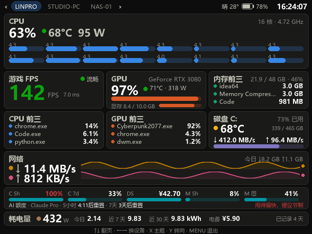
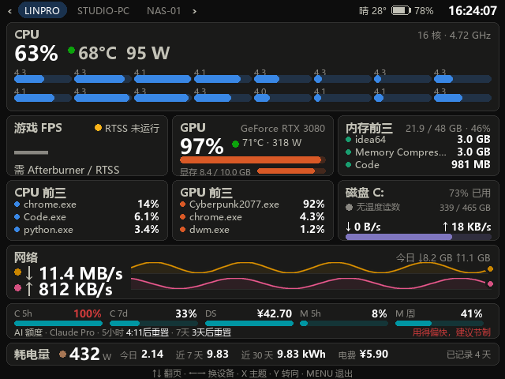
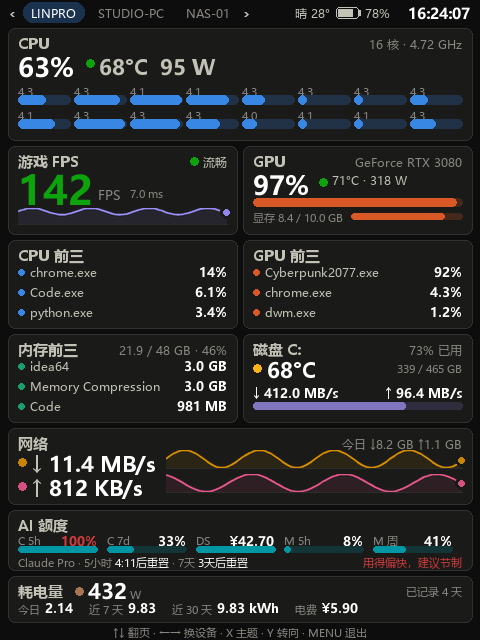
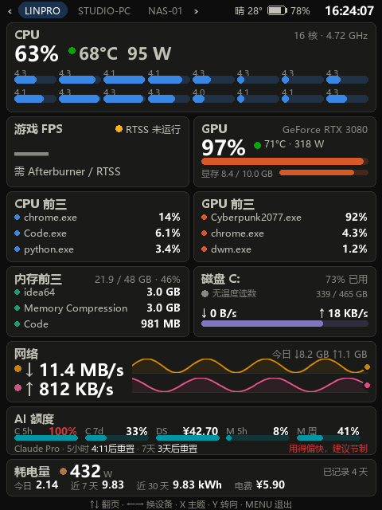

+++
date = '2024-06-18T12:51:35+08:00'
draft = false
title = 'PC Monitor — 掌机 WiFi 实时看电脑状态'
categories = ["项目"]
tags = ["掌机"]
+++

在 Windows PC 上跑一个小服务，把 CPU / 内存 / 网络 / GPU / 游戏 FPS 画成一张仪表盘，通过 WiFi 以 MJPEG 流推给掌机全屏显示。掌机会自己扫局域网找出所有能监控的 PC，左右键切换，Y 键转屏（支持竖屏），自己的电量也会显示在顶栏、低电量时震动。

支持三类掌机，共用同一个 PC 端服务：

| 掌机 | 系统 | 播放器 | 部署位置 |
|---|---|---|---|
| Miyoo Mini Plus | Onion OS | ffplay | `/mnt/SDCARD/App/PCMonitor` |
| Powkiddy X55 等 RK3566 机器 | ROCKNIX | mpv | `/storage/roms/ports` |
| Anbernic RG35XX Pro 等 | muOS | ffmpeg → `/dev/fb0` | `/mnt/mmc/MUOS/application/PC Monitor` |

一屏包含：CPU 总占用 / 温度 / 功耗 / 每个逻辑核心的占用与实时频率、游戏 FPS、GPU 占用 / 温度 / 功耗 / 显存、CPU 占用前三的进程、GPU 占用前三的进程、网络实时上下行与当日累计流量、内存、掌机电量、天气（当前 + 未来 3 小时 / 6 小时 / 两天的温度和天气）、以及 AI 额度（Claude / DeepSeek / MiniMax 的用量条）。

**为什么这么设计**：掌机是 ARMv7 双核、没有 python/lua/编译器，但自带 `ffplay`。所以让 PC 承担全部采集与绘图，掌机只解码一路 640×480 MJPEG——完全在 Cortex-A7 的能力范围内，也不需要交叉编译任何东西。

## 效果图

`preview.py` 用假数据渲染的仪表盘，横 / 竖两套版式各一张（进游戏 / 平时）：

| 横版 · 进游戏 | 横版 · 平时 |
|---|---|
|  |  |

| 竖版 · 进游戏 | 竖版 · 平时 |
|---|---|
|  |  |

## 组成

| 文件 | 作用 |
|---|---|
| `server.py` | MJPEG 服务，帧生产线程 + HTTP 接口 |
| `metrics.py` | 采集 CPU / 内存 / 网络 / GPU / 进程 / 当日流量 |
| `perfcounters.py` | 通过 PDH 性能计数器读 CPU / GPU 各进程占用（带本地化处理） |
| `sensors.py` | 从 MSI Afterburner 共享内存读 CPU 温度 / 功耗 / 每核频率 |
| `rtss.py` | 从 RivaTuner 共享内存读游戏 FPS |
| `weather.py` | 天气：公网 IP 定位 / 城市名解析 / 经纬度，Open-Meteo 免费接口 |
| `aiquota.py` | 轮询 Claude / DeepSeek / MiniMax 的额度与余额 |
| `webjson.py` | 共享的 HTTP GET + JSON 小助手 |
| `render.py` | Pillow 绘制仪表盘（横/竖两套版式 + 旋转 + 180° 预旋转） |
| `preview.py` | 用假数据出图，改版式时看效果 |
| `make_icon.py` | 生成掌机启动器图标 |
| `deploy_device.py` | 把掌机端推送过去（`--miyoo` / `--rocknix` / `--muos`） |
| `paths.py` | 区分「exe 旁边的可写文件」和「打包进去的只读文件」 |
| `build_exe.py` | 打包成单文件 `dist/PCMonitor.exe` |
| `device/` | 掌机端，一个固件一套 |

## 用 exe 跑（推荐，换机器不用装环境）

```shell
python -m pip install pyinstaller
python build_exe.py
```

产出 `dist/PCMonitor.exe`（单文件，约 17 MB）。**复制到任何 Windows 机器上双击即可**，不需要装 Python / psutil / Pillow。

- `config.json`、`traffic.json` 会生成在 **exe 所在目录**。
- 开机自启：`PCMonitor.exe --install-autostart`，取消用 `--remove-autostart`。
- 换端口：`PCMonitor.exe --port 8888`（或改 `config.json` 里的 `port`）。

## 从源码跑

```shell
python -m pip install psutil pillow paramiko
```

1. **PC 端启动**：双击 `start.bat`，或 `python server.py`，浏览器打开打印出的 `settings` 地址即可调设置并实时预览（手机上也能开）。
2. **开机自启**：`python server.py --install-autostart`。
3. **掌机端部署**：

   ```shell
   python deploy_device.py                    # Miyoo / Onion，覆盖全部文件
   python deploy_device.py --rocknix          # ROCKNIX
   python deploy_device.py --muos             # muOS
   python deploy_device.py --muos --keep-settings   # 保留掌机上已改的 settings.cfg
   ```

4. **掌机上打开**：Onion 在 `Apps` 菜单，ROCKNIX 在 `Ports` 菜单，muOS 在 `Applications` 菜单，都叫 **PC Monitor**。

> ⚠️ **重新部署前先在掌机上退出本应用。** busybox 的 sh 会边跑边读脚本文件，覆盖正在运行的 `launch.sh` 会让它执行错乱并留下一堆僵尸进程。

## 掌机上的操作

| 按键 | 作用 |
|---|---|
| **LEFT / RIGHT** | 切换设备（在扫到的 PC 之间循环） |
| **Y** | 转屏，4 档：横向 → 竖向 → 横向倒置 → 竖向（另一侧） |
| **MENU** | 退出 |

当前选的设备和朝向记在 `state.cfg` 里，下次打开还是这个视角。

### 自动发现

启动时掌机先用上次记住的设备出画面，同时在后台扫本机 `/24` 网段：对每个地址 `nc -w 1` 试 `PC_PORT`，端口开着的再取一次 `/config.json`，能解析出 `name` 的才算一台 PC Monitor，结果写进 `hosts.txt`。32 路并发扫完 254 个地址约 5–9 秒。

扫描是**循环进行**的，间隔由 `DISCOVER_EVERY_S`（默认 120 秒）控制：新开机的 PC 会在下一次扫描后自己出现在设备条里，不用退出重开。只有列表真变了才会打断当前画面重连一次。

### 竖屏

朝向由掌机通过 `?orient=N`（0–3）告诉 PC，**版式和旋转都在 PC 端完成**：0/2 用横版 640×480，1/3 用竖版 480×640 再旋转进 640×480 的画框。竖版不是把横版硬转——它是单独一套自适应高度的版式，走势曲线一条都不少。

### 180° 预翻转：掌机自己算掉，不动服务端

Miyoo 的面板是**倒装**的，所以 PC 在最后统一翻 180°（`config.json` 里的 `rotate180`）。ROCKNIX 这台不倒装，多的这 180° 得去掉——不是让 PC 别翻，而是**掌机自己用 orient 抵消**：`orient+2` 恒等于再转 180°，而且奇偶不变、版式也不变。

## 设置页面

浏览器打开 `http://<PC>:8765/settings`：

- **刷新速率** 1–30 fps，带 5 档预设，实时估算带宽占用
- **画质** JPEG 质量 40–95
- **预旋转 180°** 开关
- **天气位置**：经纬度 / 城市名 / 都留空自动定位
- 页脚带一路实时预览（始终是正着的，跟着掌机的横竖切换）

改动**立即生效并写入 `config.json`**。改帧率时服务端递增一个 generation 计数并踢掉所有在线的流客户端；掌机的 `launch.sh` 循环重连时会先读当前帧率再启动 ffplay——全程约 1–2 秒，掌机自动跟随，不用手动对齐两处配置。

### 配置项

PC 端 `config.json`：

| 键 | 默认 | 说明 |
|---|---|---|
| `port` | 8765 | 监听端口 |
| `fps` | 8 | 帧率。约 33 KB/帧，8 fps ≈ 2.2 Mbps |
| `jpeg_quality` | 72 | JPEG 质量 |
| `rotate180` | true | 预旋转 180°，匹配 Miyoo 面板方向 |
| `weather_city` / `weather_lat` / `weather_lon` | 空 | 天气定位，三选一 |
| `deepseek_key` | 空 | DeepSeek 额度查询的 API key |
| `minimax_key` / `minimax_region` | 空 / `cn` | MiniMax 额度查询的 API key 与地域 |

## 天气小组件

一个小方块显示当前城市、温度和天气图标，外加未来 3 小时 / 6 小时 / 第二天 / 第三天的预报。数据来自 **Open-Meteo**，免费、不需要任何 key。

定位三选一（设置页填写），优先级从高到低：

1. **经纬度**（`weather_lat` / `weather_lon`）——直接按坐标查；
2. **城市名**（`weather_city`）——中英文都行，走 Open-Meteo 自带的免费 geocoder 解析成坐标，按名字缓存；
3. **都留空**——按公网 IP 定位一次，之后缓存一段时间。

> 走代理 / VPN 时公网 IP 会定位到别的国家，所以只要填一下城市名即可，不用自己查经纬度。

## AI 额度

`aiquota.py` 后台轮询三家 API 的额度，画成用量条：

- **Claude**：5 小时 / 7 天用量条，带 Opus 开关和 `extra` 计费额度（直接问 Anthropic）；
- **DeepSeek**：账户余额；
- **MiniMax**：按**模型组**分（"general" 文本、视频等），仪表盘取文本额度，`/ai` 页面列全部并带各自的 5 小时 / 7 天用量和重置时间。

浏览器开 `http://<PC>:8765/ai` 看完整明细；没配 key 的提供商直接显示为"未配置"，配了 key 一分钟后自动点亮，不用重启服务。

## 游戏 FPS

FPS 来自 **RivaTuner Statistics Server (RTSS)** 的共享内存。**RTSS 没运行时 FPS 显示 `—` 并提示启动它**，其余指标不受影响。

**只认前台窗口所属进程。** RTSS 会钩住所有 Direct3D 程序，直接取"最新条目"会显示成毫无意义的数字。所以只匹配 `GetForegroundWindow()` 对应的 PID；切出游戏时显示"无游戏 / 前台没有游戏画面"。

## 掌机电量与震动

掌机每 60 秒把自己的电量报给 PC，PC 按**请求来源地址**归属这条数据，多台掌机不会互相覆盖，超过 120 秒没有新上报就不再显示。顶栏画一个电池图形：>30% 普通字色，≤30% 转黄，≤15% 转红，充电时转绿并加 ⚡。

**低电量震动**：不充电且电量 ≤ `BATT_LOW_PCT`（默认 15）时震一下，最短间隔 `BATT_BUZZ_GAP_S`（默认 600 秒）。Onion 的 `.noVibration` 开关会被尊重，`BATT_LOW_PCT=0` 可以单独关掉震动。

## HTTP 接口

| 路径 | 内容 |
|---|---|
| `/` `/settings` | 设置页（POST 同一路径提交表单） |
| `/stream.mjpg?orient=N&devs=a,b&i=K` | 裸 JPEG 连续流，给掌机的播放器 |
| `/preview.mjpg` | `multipart/x-mixed-replace`，给浏览器 |
| `/preview` | 只有预览的页面 |
| `/frame.jpg` | 当前单帧 |
| `/config.json` | 当前生效的设置 + `name`（主机名） |
| `/battery?pct=57&charging=0` | 掌机上报自己的电量 |
| `/ai` | AI 额度明细页（Claude / DeepSeek / MiniMax 全部字段） |
| `/stats.json` | 原始快照，想自己做别的客户端就用这个 |

## 已知限制

- **CPU 温度和功耗依赖 MSI Afterburner 在运行**。建议设成开机启动，它和 RTSS 是一套。
- **当日流量只统计服务运行期间**。
- 掌机端在等 PC 时是**黑屏**，不显示提示，日志里能看到状态。
- 发现只扫**本机所在的 /24 网段**，跨网段的 PC 需要手动往 `hosts.txt` 里加一行。
- **ROCKNIX 上没有低电量震动**（手柄的力反馈要下 ioctl，shell 做不到）；Onion 和 muOS 上有。
- **ROCKNIX 上切设备/转屏比 Miyoo 慢一点**（约 1–2 秒），mpv 每次启动要现编 Vulkan 管线。
